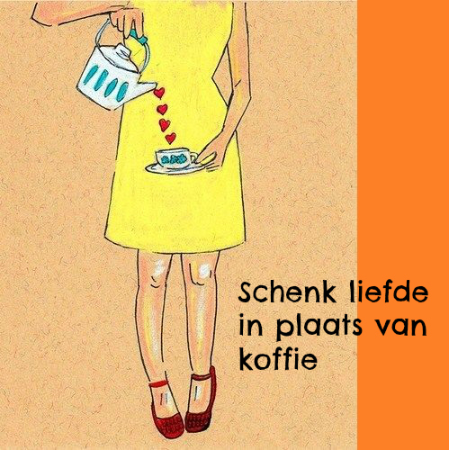

# Defrosting the world

This repository contains the source code for an art project by De
Wereldontdooisters, including all of the art they have produced
during this project's lifetime in the [media](media/) directory.

## Installation

Install Python and run the following commands:

     pip install -r requirements.txt
     ./manage.py migrate
     ./manage.py createsuperuser
     ./manage.py runserver

## Usage

Visit http://localhost:8000/beheer/ to add content.
